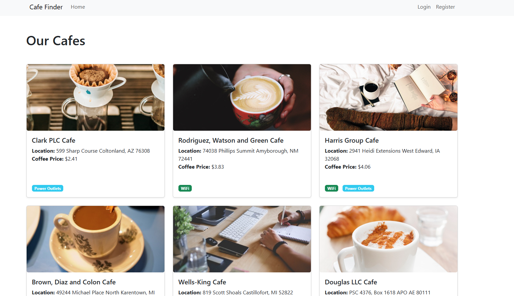

# Cafe Website

A Flask-based web application for discovering and sharing information about cafes. Users can browse cafes, view their amenities, and contribute new cafe listings to the database.



## Features

- User authentication (register, login, password reset)
- Browse cafe listings with detailed information
- Add new cafes to the database
- View cafe details including:
  - Location
  - Amenities (WiFi, power sockets, toilets)
  - Seating capacity
  - Coffee prices
  - Whether calls can be taken
- adding, editing and deleting cafe reviews
- User account management
- Email notifications for password reset

## Tech Stack

- **Backend**: Python Flask 3.1.x
- **Database**: SQLite with SQLAlchemy ORM 3.1.x
- **Authentication**: Flask-Login 0.6.x
- **Email Service**: Flask-Mail 0.10.x
- **Frontend**: HTML, CSS, Jinja2 3.1.x Templates

## Prerequisites

- Python 3.13.x
- pip (Python package manager)

## Installation

1. Clone the repository:
```bash
git clone https://github.com/DeanJ93/Cafe_website.git
cd Cafe_website
```

2. Create a virtual environment (recommended):
```bash
python -m venv venv
source venv/bin/activate  # On Windows use: venv\Scripts\activate
```

3. Install dependencies:
```bash
pip install -r requirements.txt
```

4. Set up environment variables:
Create the following emvrironment variables:
```
mail_username=your_email@gmail.com
mail_password=your_email_app_password
secret_key=your_secret_key
```

## Running the Application

1. Start the Flask server:
```bash
python app.py
```

## Populating the database
You can populate.py in the scripts folder to add fake data to the database.

```bash
python scripts/populate_db.py
```

2. Open your web browser and navigate to `http://localhost:5000`

## License

This project is licensed under the MIT License - see the LICENSE file for details.
